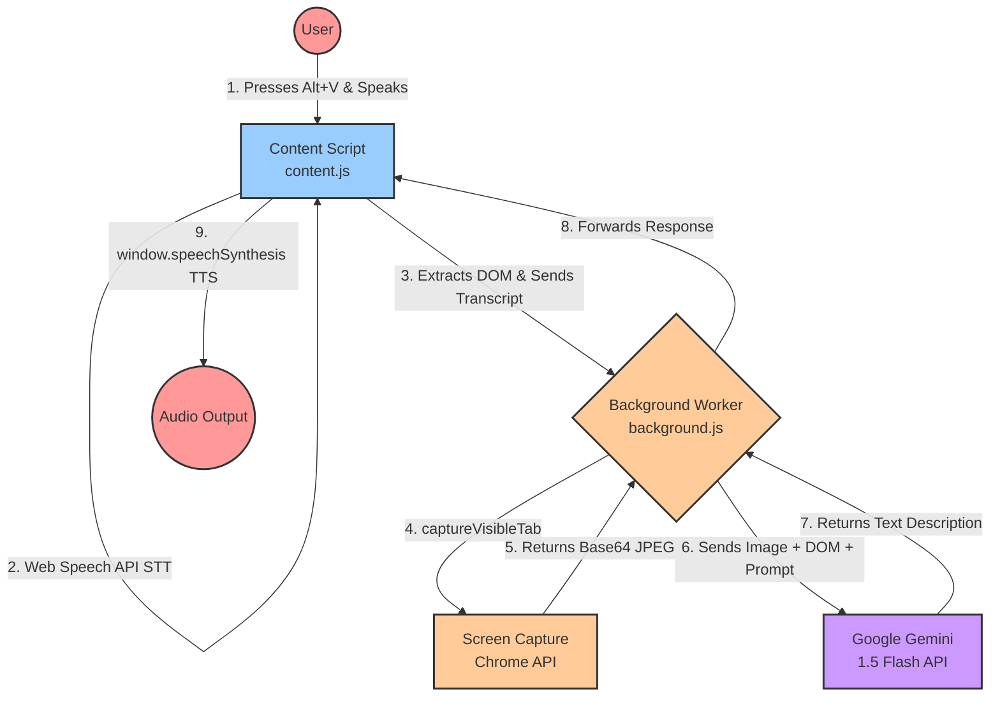

# 👁️ VisionAssist AI

**VisionAssist AI** is a multi-modal, real-time visual assistant Chrome Extension designed to empower totally blind users. By leveraging native browser APIs alongside cutting-edge AI (Google Gemini 1.5 Flash), VisionAssist acts as an intelligent, conversational screen reader that understands both the *code* and the *visual structure* of a webpage.

---

## ✨ Features

*   **🎤 Voice-Activated Interface:** Activated globally via a simple keyboard shortcut (`Alt + V`). The system listens to natural language prompts (e.g., *"What is this page about?"*, *"Are there any login buttons?"*).
*   **📷 Multi-Modal AI Analysis:** Captures both a visual screenshot of the current viewport and an optimized extraction of the webpage's DOM (titles, headings, visible interactive buttons, and links).
*   **⚡ Ultra-Low Latency:** Uses `gemini-1.5-flash` to process both visual and code-based context rapidly and return concise, actionable descriptions.
*   **🔊 Audio Feedback & TTS:** Uses the Web Audio API to provide subtle auditory cues (beeps) indicating when the microphone is listening and when the AI is processing, followed by native Text-to-Speech (TTS) reading the AI's response aloud.
*   **🔐 Secure BYOK (Bring Your Own Key):** A clean Options UI allows users to safely input and store their Gemini API key in `chrome.storage.local`.

---

## 🛠️ Tech Stack & Architecture

### System Flow


*   **Platform:** Chrome Extension (Manifest V3)
*   **Languages:** Vanilla JavaScript (ES6+), HTML5, CSS3
*   **AI Integration:** Google Gemini API (`gemini-1.5-flash`)
*   **Native APIs:** 
    *   `webkitSpeechRecognition` (Speech-to-Text)
    *   `window.speechSynthesis` (Text-to-Speech)
    *   `chrome.tabs.captureVisibleTab` (Screenshot Generation)
    *   `AudioContext` (Navigational Beeps)
    *   `chrome.storage.local` (Secure local data retention)

---

## 🚀 Installation & Setup

### 1. Load the Extension
1. Clone or download this repository.
2. Open Google Chrome and navigate to `chrome://extensions/`.
3. Enable **Developer mode** in the top right corner.
4. Click **Load unpacked** in the top left corner and select the repository directory.

### 2. Configure the API Key
1. Click the **VisionAssist AI** puzzle piece icon in your Chrome toolbar.
2. Click **Configure API Key** (or right-click the extension icon and select "Options").
3. Paste your [Google Gemini API Key](https://aistudio.google.com/app/apikey) into the secure input field and click **Save**.

---

## ⌨️ How to Use

1. Navigate to any standard webpage. *(Note: Chrome restricts extensions from running on system pages like `chrome://` or the New Tab page).*
2. Click anywhere on the page to ensure it is actively focused.
3. Press **`Alt + V`** on your keyboard.
4. Listen for the **first beep**, then speak your query into your microphone.
5. Listen for the **second beep** indicating that the AI is processing.
6. The AI will audibly read out its contextual analysis of your page.

---

## 📂 File Structure

```text
/vision-assist-ai
  ├── manifest.json       # Manifest V3 Configuration & Permissions
  ├── background.js       # Service Worker: Gemini API & Screenshot orchestration
  ├── content.js          # Content Script: Voice UI, TTS, DOM Extraction, Audio Cues
  ├── README.md           # Documentation
  ├── popup/
  │   ├── popup.html      # Extension toolbar dropdown UI
  │   ├── popup.css
  │   └── popup.js
  └── options/
      ├── options.html    # Configuration page for API Key & Demo Mode
      ├── options.css
      └── options.js
```

---

*Built for Accessibility. Designed for Independence.*